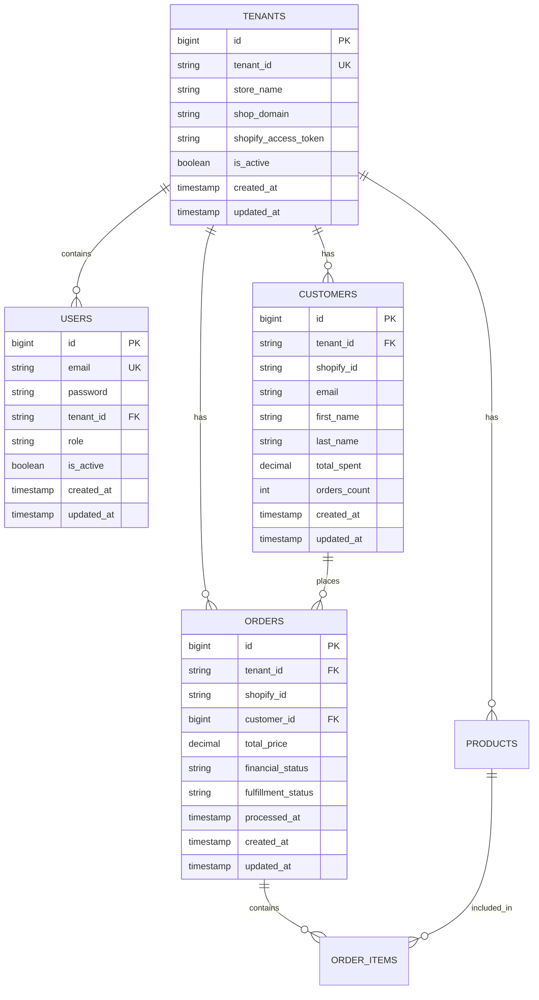

# Xeno FDE Assignment - System Architecture

## 🏗️ High-Level Architecture

This application follows a modern microservices architecture with multi-tenant data isolation, designed to handle Shopify data ingestion and analytics at scale.

```
┌─────────────────┐    ┌─────────────────┐    ┌─────────────────┐
│   React Frontend │    │  Spring Boot    │    │   MySQL         │
│                 │    │  Backend API    │    │   Database      │
│  - Dashboard    │◄──►│                 │◄──►│                 │
│  - Analytics    │    │  - REST APIs    │    │  - Multi-tenant │
│  - Auth         │    │  - JWT Auth     │    │  - Analytics    │
└─────────────────┘    │  - Multi-tenant │    │  - Relationships│
                       └─────────────────┘    └─────────────────┘
                                │
                                ▼
                       ┌─────────────────┐
                       │  Shopify APIs   │
                       │                 │
                       │  - Customers    │
                       │  - Orders       │
                       │  - Products     │
                       │  - Webhooks     │
                       └─────────────────┘
```

## 🎯 Core Components

### 1. Frontend (React.js)
- **Technology**: React 18 + Material-UI + TypeScript
- **Features**:
  - Responsive analytics dashboard
  - JWT-based authentication
  - Real-time charts and visualizations
  - Tenant-aware data filtering
  - Mobile-responsive design

### 2. Backend (Spring Boot)
- **Technology**: Java 17 + Spring Boot 3.x + JPA/Hibernate
- **Features**:
  - RESTful API design
  - JWT authentication & authorization
  - Multi-tenant data isolation
  - Shopify API integration
  - Webhook processing
  - Scheduled data synchronization

### 3. Database (MySQL)
- **Technology**: MySQL 8.0
- **Features**:
  - Multi-tenant schema design
  - Optimized indexes for analytics queries
  - Foreign key relationships
  - Database views for complex analytics
  - Audit trail with timestamps

### 4. Integration Layer
- **Shopify API Integration**:
  - REST API client for data ingestion
  - Webhook endpoints for real-time updates
  - Rate limiting compliance
  - Error handling and retry logic

## 🏢 Multi-Tenant Architecture

### Tenant Isolation Strategy
The application uses **Schema-based multi-tenancy** with a shared database:

```sql
-- Every table includes tenant_id for isolation
CREATE TABLE customers (
    id BIGINT PRIMARY KEY AUTO_INCREMENT,
    tenant_id VARCHAR(255) NOT NULL,  -- Tenant isolation key
    shopify_id VARCHAR(255) NOT NULL,
    email VARCHAR(255),
    ...
    INDEX idx_tenant_shopify (tenant_id, shopify_id)
);
```

### Data Access Pattern
```java
@Repository
public interface CustomerRepository extends JpaRepository<Customer, Long> {
    List<Customer> findByTenantId(String tenantId);
    List<Customer> findByTenantIdAndTotalSpentGreaterThan(String tenantId, BigDecimal amount);
}
```

### Benefits
- **Data Isolation**: Complete separation between tenants
- **Cost Effective**: Shared infrastructure with logical separation
- **Scalable**: Easy to add new tenants without schema changes
- **Secure**: Row-level security through tenant context

## 📊 Database Schema Design

### Core Entities



### Analytics Views
```sql
-- Pre-computed analytics for performance
CREATE VIEW customer_analytics AS
SELECT 
    tenant_id,
    COUNT(*) as total_customers,
    AVG(total_spent) as avg_customer_spend,
    SUM(total_spent) as total_revenue
FROM customers 
GROUP BY tenant_id;
```

## 🔐 Security Architecture

### Authentication Flow
```
1. User Login Request
   ↓
2. Validate Credentials
   ↓
3. Generate JWT Token (with tenant_id)
   ↓
4. Return Token to Client
   ↓
5. Client includes token in API calls
   ↓
6. Server validates token & extracts tenant_id
   ↓
7. Filter all queries by tenant_id
```

### JWT Token Structure
```json
{
  "sub": "user@example.com",
  "tenantId": "tenant_abc123",
  "role": "USER",
  "iat": 1640995200,
  "exp": 1641081600
}
```

### Security Features
- **Password Encryption**: BCrypt hashing
- **JWT Tokens**: Secure token-based authentication
- **CORS Protection**: Configured for frontend domains
- **SQL Injection Prevention**: JPA parameterized queries
- **Input Validation**: Bean validation annotations

## 🔄 Data Synchronization

### Shopify Integration Patterns

#### 1. Full Synchronization
```java
@Scheduled(cron = "0 0 2 * * ?") // Daily at 2 AM
public void performFullSync() {
    for (Tenant tenant : activeTenants) {
        syncCustomers(tenant);
        syncProducts(tenant);
        syncOrders(tenant);
    }
}
```

#### 2. Webhook Processing
```java
@PostMapping("/shopify/webhooks/orders/create")
public ResponseEntity<?> handleOrderCreated(@RequestBody OrderWebhook webhook) {
    processOrderWebhook(webhook);
    return ResponseEntity.ok().build();
}
```

#### 3. Incremental Updates
- Process webhooks for real-time updates
- Periodic sync for data consistency
- Error handling and retry mechanisms

## 📈 Performance Optimizations

### Database Optimizations
- **Composite Indexes**: `(tenant_id, shopify_id)` on all tables
- **Analytics Views**: Pre-computed metrics for dashboards
- **Connection Pooling**: HikariCP for efficient connections
- **Query Optimization**: JPA query hints and fetch strategies

### Caching Strategy
```java
@Cacheable(value = "customerAnalytics", key = "#tenantId")
public CustomerAnalytics getCustomerAnalytics(String tenantId) {
    // Expensive analytics computation
}
```

### API Performance
- **Pagination**: Limit large result sets
- **Field Selection**: Return only requested fields
- **Async Processing**: Non-blocking webhook processing
- **Rate Limiting**: Respect Shopify API limits

## 🚀 Deployment Architecture

### Development Environment
```yaml
version: '3.8'
services:
  mysql:
    image: mysql:8.0
    ports: ["3306:3306"]
    
  backend:
    build: ./backend
    ports: ["8080:8080"]
    depends_on: [mysql]
    
  frontend:
    build: ./frontend
    ports: ["3000:3000"]
    depends_on: [backend]
```

### Production Considerations
- **Load Balancing**: Multiple backend instances
- **Database Clustering**: Master-slave replication
- **CDN**: Static asset delivery
- **Monitoring**: Application metrics and logging
- **SSL/TLS**: HTTPS encryption
- **Backup Strategy**: Regular database backups

## 📊 Monitoring & Observability

### Application Metrics
- **Spring Boot Actuator**: Health checks and metrics
- **Custom Metrics**: Business-specific KPIs
- **Database Metrics**: Query performance and connections
- **API Metrics**: Response times and error rates

### Logging Strategy
```java
@Slf4j
@Component
public class ShopifyService {
    public void syncCustomers(String tenantId) {
        log.info("Starting customer sync for tenant: {}", tenantId);
        MDC.put("tenantId", tenantId);
        // ... sync logic
        log.info("Completed customer sync. Processed {} records", count);
    }
}
```

## 🔄 API Design Patterns

### RESTful Endpoints
```
GET    /api/customers              # List customers (tenant-filtered)
POST   /api/customers              # Create customer
GET    /api/customers/{id}         # Get customer details
PUT    /api/customers/{id}         # Update customer
DELETE /api/customers/{id}         # Delete customer

GET    /api/analytics/dashboard    # Dashboard metrics
GET    /api/analytics/customers    # Customer analytics
GET    /api/analytics/orders       # Order analytics
```

### Response Format
```json
{
  "success": true,
  "data": {
    "customers": [...],
    "pagination": {
      "page": 1,
      "size": 20,
      "total": 150,
      "totalPages": 8
    }
  },
  "timestamp": "2025-01-15T10:30:00Z"
}
```

## 🏗️ Scalability Considerations

### Horizontal Scaling
- **Stateless Backend**: Multiple instances behind load balancer
- **Database Sharding**: Partition by tenant_id if needed
- **Microservices**: Split by domain (customers, orders, analytics)
- **Message Queues**: Async processing for webhooks

### Vertical Scaling
- **Database Optimization**: Better indexes and query optimization
- **Caching Layers**: Redis for frequently accessed data
- **Connection Pooling**: Optimize database connections
- **Resource Allocation**: CPU and memory tuning

This architecture provides a solid foundation for a scalable, multi-tenant Shopify analytics platform with room for future enhancements and optimizations.
